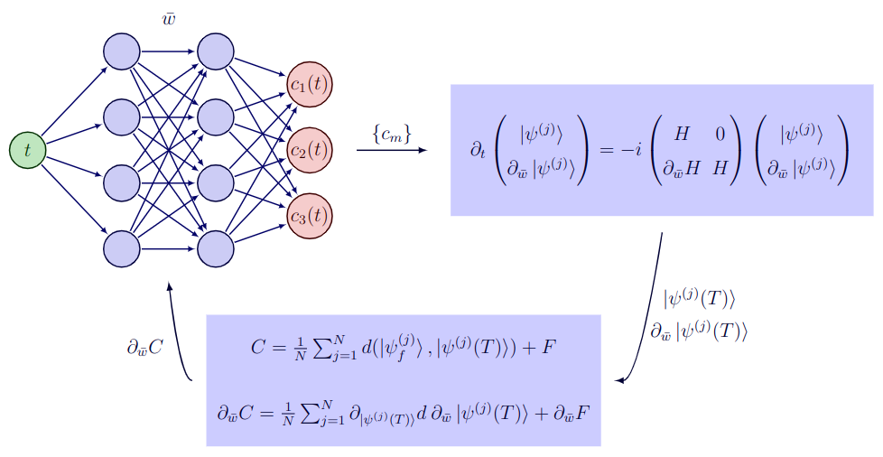

# Gradient-based quantum optimal control

A general QOC problem aims to find time-dependent control knobs to simultaneously guide the evolution of a given set of input states to some chosen target states subject to physical and hardware constraints. Let us denote the input and target states of the problem $|\psi^{(1)}_i\rangle, |\psi^{(2)}_i\rangle, \dots |\psi^{(N)}_i\rangle$ and $|\psi^{(1)}_f\rangle, |\psi^{(2)}_f\rangle, \dots |\psi^{(N)}_f\rangle$ respectively. Without loss of generality, the time-dependent Hamiltonian governing the dynamics of a quantum system can be written as,

$$H(t) = H_0 + H_c(t) = H_0 + \sum_{m=1}^{M} c_m(t) H_m.$$

The control drives $c_1(t), c_2(t), \dots c_M(t)$ define the unitary transformation:

$$U(\{c_m\}, T) = e^{-i \int_0^T H(t) \mathrm{d}t}.$$

The drives $\{c_k(t)\}$ are designed by optimizing a certain cost function. In practice, the cost function is chosen to reflect the quality of the desired transformation and by constraining the pulses:

$$C(\{c_m\}) = \frac{1}{N}\sum_{j=1}^{N}  d(|\psi^{(j)}_f\rangle, U(\{c_m\}, T)|\psi^{(j)}_i\rangle) + F(\{c_m(t)\}),$$
where $d(|\psi^{(j)}_f\rangle, U(\{c_m\}, T)|\psi^{(j)}_i\rangle)$ is some distance measure and $F$ takes into account the experimental constraints such as bounds on control signals, finite bandwidth and power etc.

Numerical methods such as GRAPE and Krotov solve the optimal control problem by representing the drive signals as piece-wise constant functions and iteratively optimizing these discrete values based on the gradient of the cost function with respect to the control parameters\cite{Leung2017, arxiv1902.11284}. In these approaches, for a given set of control signals, the resulting unitary transformation is computed by first-order Trotterization of each time slice. These methods are inherently prone to discretization errors and one must sample the control signals sufficiently to obtain high fidelity protocols. A continuous parametrization of drive signals, combined with higher-order ordinary differential equation solvers is essential for numerical optimal control problems when accuracy can not be traded with computational effort.

Optimization of high-dimensional optimal control problems tends to converge poorly with derivative-free optimizers \cite{machnes2018}. Therefore, we need an efficient evaluation of the gradients,

$$\frac{\partial C(\{c_m\})}{\partial w_k} = \frac{1}{N}\sum_{j=1}^{N} \frac{\partial}{\partial w_k}d\left(|\psi^{(j)}_f\rangle, |\psi^{(j)}(T)\rangle\right) + \frac{\partial F}{\partial w_k}.$$
where $|\psi^{(j)\rangle(T)} = U(\{c_m\}, T)|\psi^{(j)}_i\rangle$, and $w_k$ parameterize the control signals $\{c_m\}$. The second term in the above equation can be evaluated with standard automatic differentiation techniques. The first term can be efficiently calculated without propagating the derivative through the ODE solver using the adjoint sensitivity method \cite{chen2019}.
$$\frac{\partial}{\partial w_k}d\left(|\psi^{(j)}_f\rangle, |\psi^{(j)}(T)\rangle\right) = \frac{\partial d(x,y)}{\partial y} \Big|_{x=|\psi^{(j)}_f\rangle, y = |\psi^{(j)}(T)\rangle} \frac{\partial|\psi^{(j)}(T)\rangle}{\partial w_k}$$

For a closed quantum system, we get the following augmented system of equations,

$$\frac{\mathrm{d}|\psi^{(j)}\rangle}{\mathrm{d}t} = -i H(t) |\psi^{(j)}\rangle$$ 
$$\frac{\mathrm{d}}{\mathrm{d}t} \frac{\partial|\psi^{(j)}\rangle}{\partial w_k} = -i\left[H(t) \frac{\partial|\psi^{(j)}\rangle}{\partial w_k} + \sum_{m=1}^{M}\frac{\partial c_m(t)}{\partial w_k} H_m |\psi^{(j)}\rangle\right],$$
with initial conditions $|\psi^{(j)}(0)\rangle = |\psi^{(j)}_i\rangle$ and $\partial|\psi^{(j)}(0)\rangle/\partial w_k = 0$.

These coupled equations can be solved using a higher-order ODE solver and gradients w.r.t. to the parameters can be evaluated to the desired numerical accuracy. 

